<div align="center">

# 🧾 Invora — AI請求書作成ツール

### 請求書が、ひとりでに仕上がる。

一文から請求書を生成し、領収書やPDFをOCRで読み取り、取引先・テンプレート・チームを
ひとつのシンプルなツールで管理できます。

<br />

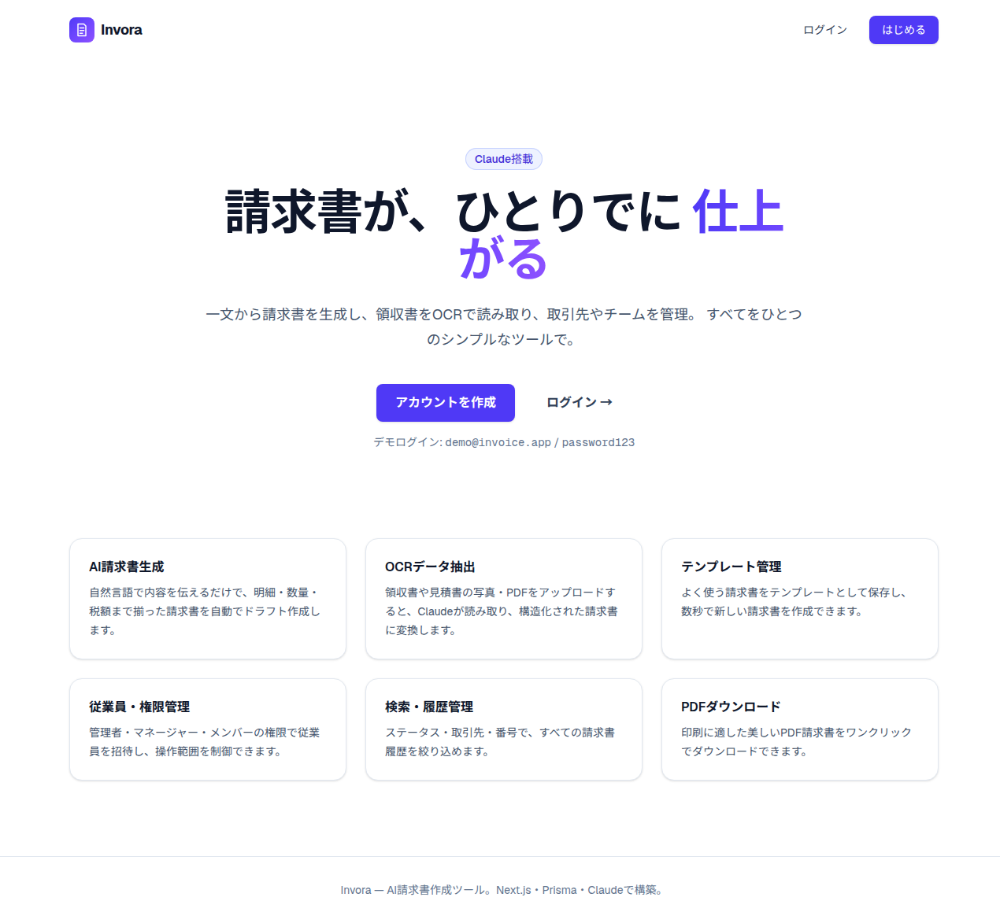

<br />


</div>

---

## 📑 目次

- [概要](#-概要)
- [スクリーンショット](#-スクリーンショット)
- [機能](#-機能)
- [AI機能の詳細](#-ai機能の詳細)
- [技術スタック](#-技術スタック)
- [セットアップ](#-セットアップ)
- [デモアカウント](#-デモアカウント)
- [権限管理](#-権限管理)
- [データモデル](#-データモデル)
- [APIリファレンス](#-apiリファレンス)
- [ディレクトリ構成](#-ディレクトリ構成)
- [スクリプト](#-スクリプト)
- [環境変数](#-環境変数)
- [本番運用について](#-本番運用について)
- [セキュリティ](#-セキュリティ)
- [今後の予定・制限事項](#-今後の予定制限事項)
- [著作権](#-著作権)

---

## 🔍 概要

**Invora** は、エンドツーエンドで構築されたマルチテナント型の請求書管理SaaSです。
各アカウントは1つの**会社**として扱われ、従業員・取引先・テンプレート・請求書を保有します。
洗練された完全レスポンシブのUIに加え、**Claude** を活用した2つのAI機能を備えています。

1. **自然言語からの請求書生成** — 内容を文章で伝えるだけで、構造化された請求書を作成します。
2. **OCRによるデータ抽出** — 領収書・見積書・PDFをアップロードすると、請求書に変換します。

そのほか、実運用に必要な機能を一通り備えています。パスワードリセット付きの認証、権限管理、
再利用可能なテンプレート、取引先管理、分析ダッシュボード、全文検索とステータス絞り込み、
ステータスワークフロー、ワンクリックのPDF出力（ブラウザ印刷）。

---

## 📸 スクリーンショット

### ダッシュボード
未収金・入金合計、直近6か月の売上推移、ステータス別内訳、最近の請求書。

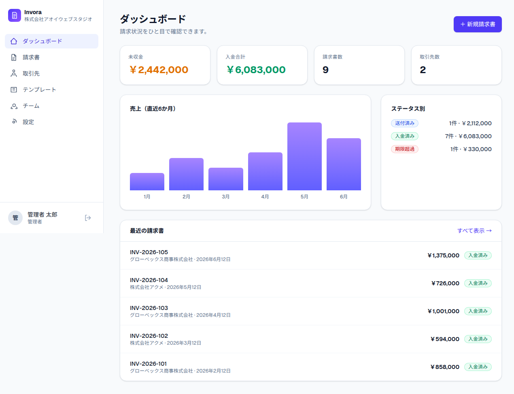

### 請求書一覧 — 検索・絞り込み・履歴
番号・取引先・メールで検索し、ステータスで絞り込めます。

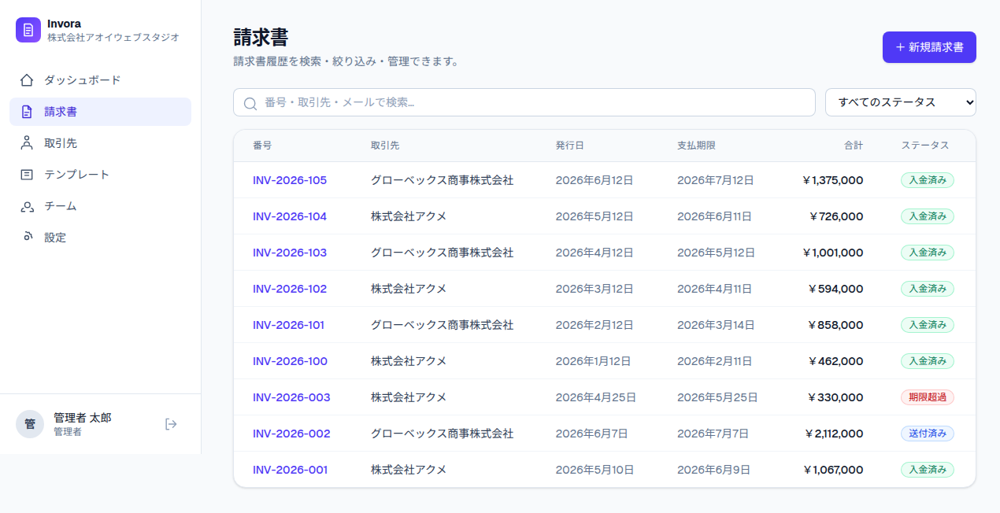

### 請求書エディタ — 手入力またはAIで作成
上部の「AIで作成」パネルで、内容を入力するかドキュメントをアップロード。
その下に、請求書情報・請求先・明細・リアルタイム集計を備えたエディタがあります。

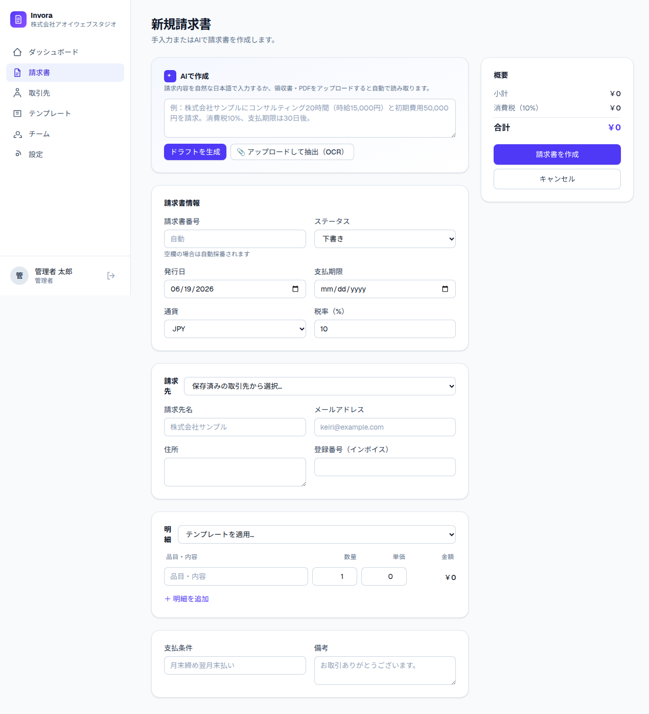

### 請求書ドキュメント & PDF出力
印刷に適した美しいドキュメント。ワンクリックの **PDF / 印刷** と、その場でのステータス変更に対応。

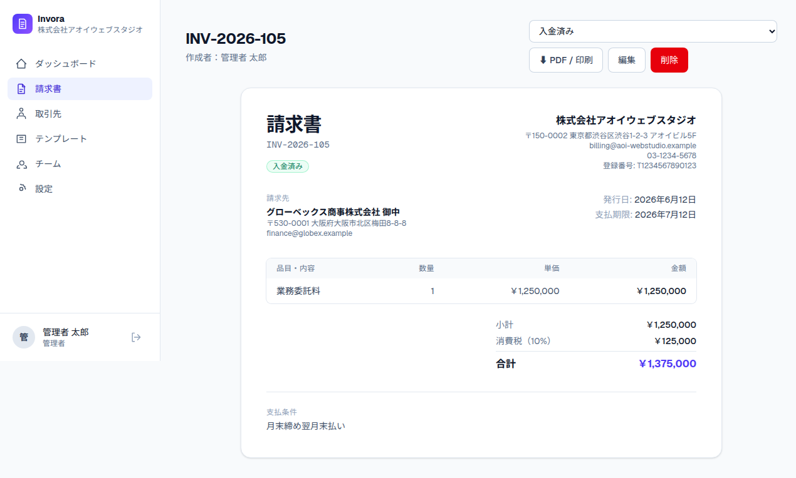

### テンプレート・取引先・チーム・設定

| テンプレート | 取引先 |
| :---: | :---: |
| 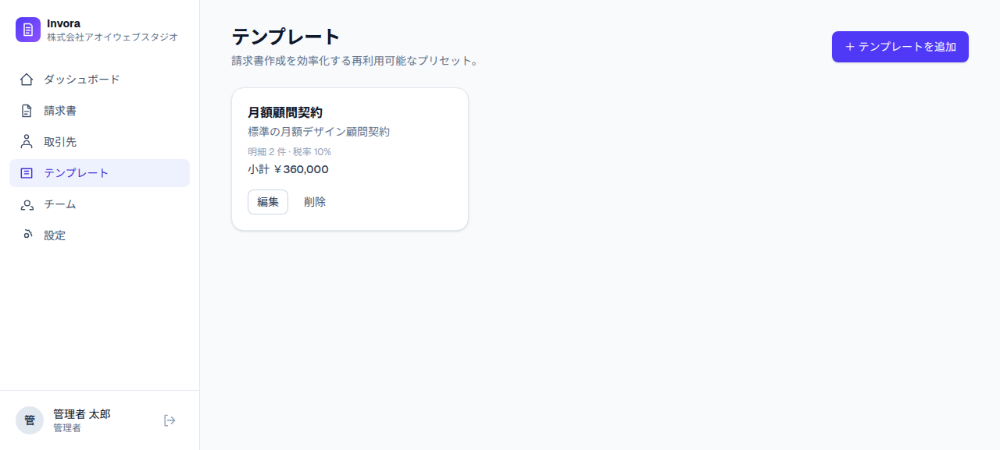 | 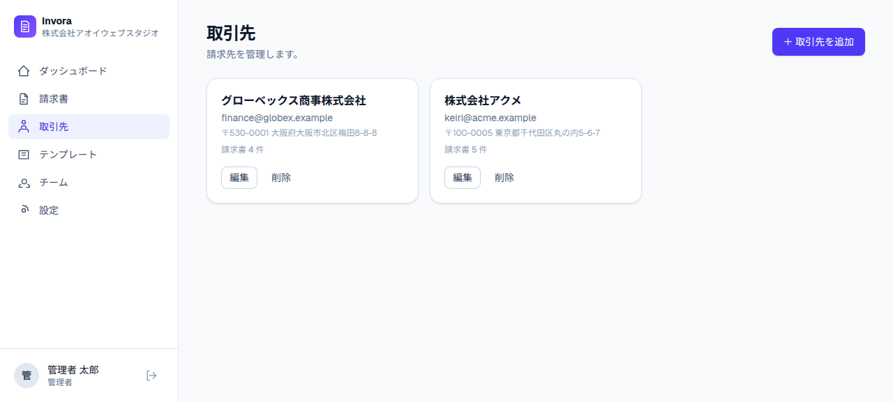 |

| チーム・権限 | 会社設定 |
| :---: | :---: |
| 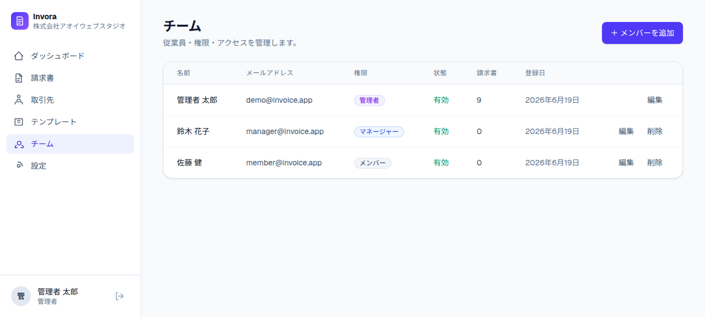 | 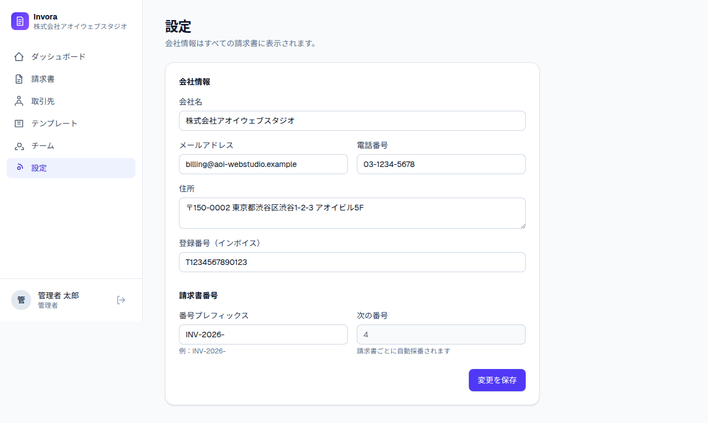 |

### 完全レスポンシブ対応
モバイルファーストのレイアウトと折りたたみ式サイドバー。スマートフォンでも快適に操作できます。

| モバイル：ダッシュボード | モバイル：請求書エディタ |
| :---: | :---: |
| 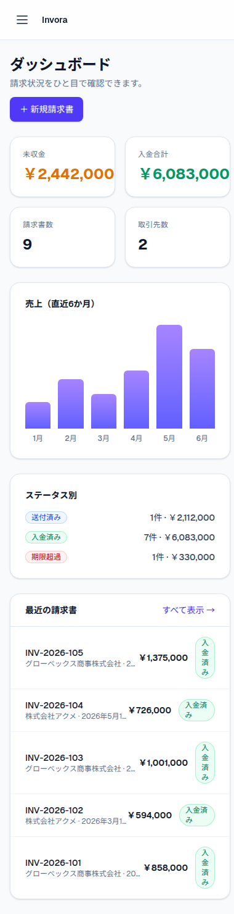 | 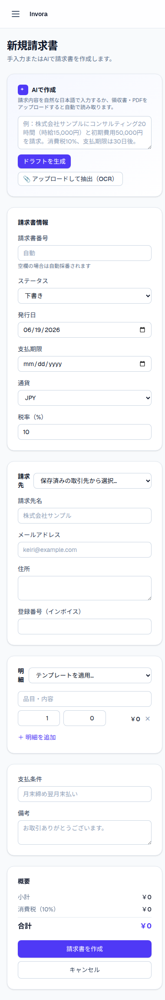 |

---

## ✨ 機能

| 分類 | 内容 |
| --- | --- |
| 🔐 **認証** | 新規登録（会社＋管理者を作成）、ログイン／ログアウト、トークン方式のパスワードリセット |
| 🤖 **AI請求書生成** | 自然な日本語で内容を伝えると、Claudeが構造化された請求書をドラフト作成 |
| 📷 **OCRデータ抽出** | 領収書・見積書の画像／PDFをアップロードすると、Claudeが請求書に変換 |
| 🧾 **請求書管理** | 作成・編集・閲覧・削除、自動採番、リアルタイムの合計・税額計算 |
| 🔎 **検索・絞り込み** | 番号・取引先・メールで検索、ステータスで絞り込み |
| 🗂️ **履歴・ステータス** | 下書き → 送付済み → 入金済み → 期限超過 → キャンセル のワークフロー |
| 📋 **テンプレート** | 既定の明細・税率・支払条件・備考を含む再利用可能なプリセット |
| 👥 **取引先管理** | 請求先を登録し、請求書に自動入力 |
| 🛡️ **チーム・権限** | 管理者／マネージャー／メンバーの権限。サーバー側で厳格に制御 |
| 📊 **ダッシュボード** | 未収金・入金合計、売上推移、ステータス別内訳、最近の請求書 |
| 📄 **PDF出力** | ワンクリックで印刷に適したPDFを出力（ブラウザ印刷、日本語完全対応） |
| 🏢 **会社設定** | すべての請求書に表示される会社情報と、請求書番号の設定 |
| 📱 **レスポンシブ** | 折りたたみ式サイドバーを備えたモバイルファースト設計 |

---

## 🤖 AI機能の詳細

AI生成とOCRは、公式の [`@anthropic-ai/sdk`](https://www.npmjs.com/package/@anthropic-ai/sdk) を通じて、
モデル `claude-opus-4-8` で Anthropic API を呼び出します。両機能は**任意**で、`ANTHROPIC_API_KEY`
を設定すると有効になります。キーが未設定でもアプリ本体は完全に動作し、AIのエンドポイントは
分かりやすい「未設定」メッセージを返します。

### 1. 自然言語からの生成 · `POST /api/ai/generate`

例えば、次のように入力します。

> 「株式会社サンプルにコンサルティング20時間（時給15,000円）と初期費用50,000円を請求。消費税10%、支払期限は30日後。」

Claudeは、**JSONスキーマで制約した構造化出力**を用いて、請求書（請求先・明細・数量・単価・税率・日付）
を返します。出力は常に有効でパース可能です。生成されたドラフトはエディタに読み込まれ、確認・調整できます。
**AIが請求書を勝手に保存することはありません。**

### 2. OCR抽出 · `POST /api/ai/ocr`

**PNG / JPG / GIF / WebP** 画像、または **PDF** をアップロードします。ファイルはClaudeのビジョン／
ドキュメント入力に送られ、すべての明細・数量・単価・税率・通貨・条件が、エディタに読み込まれる
構造化ドラフトに転記されます。

両エンドポイントはスキーマ検証・サイズ制限を備え、エラー時には分かりやすいメッセージを返します
（APIキー未設定なら `503`、非対応ファイルなら `400` など）。

---

## 🛠 技術スタック

| レイヤー | 採用技術 | 理由 |
| --- | --- | --- |
| フレームワーク | **Next.js 16**（App Router） | UI・SSR・APIを1つのコードベースで |
| 言語 | **TypeScript**（strict） | エンドツーエンドの型安全性 |
| スタイリング | **Tailwind CSS v4** | 高速で一貫したレスポンシブデザイン |
| データベース | **Prisma 6 + SQLite** | 設定不要のローカル開発。本番はPostgresへ差し替え可 |
| 認証 | **jose**（JWT）+ **bcryptjs** | httpOnlyクッキーのステートレスセッション、パスワードはハッシュ化 |
| AI | **Claude `claude-opus-4-8`** | 公式SDK経由での自然言語生成＋ビジョンOCR |
| バリデーション | **Zod** | リクエスト／レスポンスの共有スキーマ |

---

## 🚀 セットアップ

### 前提
- **Node.js 18.18以上**（推奨：Node 20以上）
- npm

### インストールと起動

```bash
# 1. 依存関係をインストール
npm install

# 2. 環境変数を設定
cp .env.example .env
#    - AUTH_SECRET     → 任意の長いランダム文字列（例: openssl rand -hex 32）
#    - ANTHROPIC_API_KEY → 任意。設定するとAI生成・OCRが有効になります

# 3. データベース（SQLite）を作成し、デモデータを投入
npx prisma migrate dev      # スキーマを作成
npm run db:seed             # デモ会社＋ユーザー3名＋サンプル請求書

# 4. 開発サーバーを起動
npm run dev                 # → http://localhost:3000
```

ブラウザで **http://localhost:3000** を開き、下記のデモアカウントでログインしてください。

---

## 👤 デモアカウント

シード投入後、次のアカウントが利用できます（パスワードはすべて `password123`）。

| メールアドレス | パスワード | 権限 |
| --- | --- | --- |
| `demo@invoice.app` | `password123` | **管理者** |
| `manager@invoice.app` | `password123` | **マネージャー** |
| `member@invoice.app` | `password123` | **メンバー** |

<div align="center">

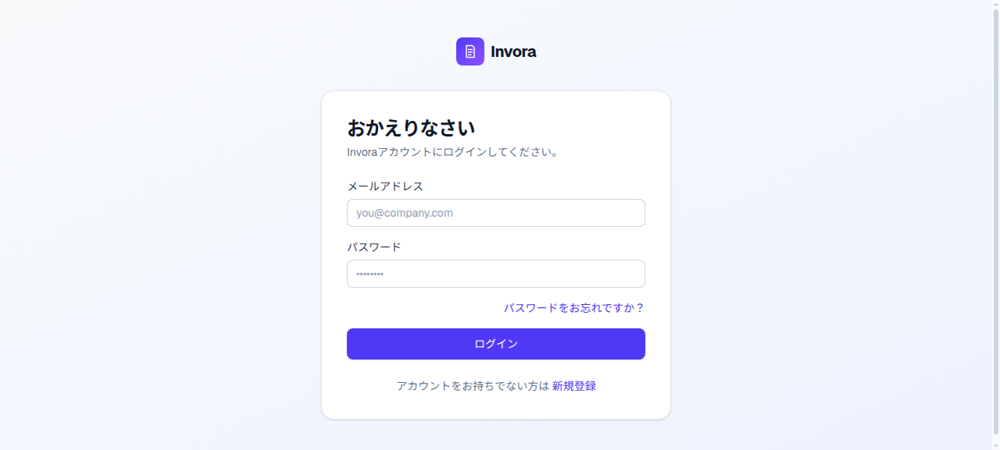

</div>

---

## 🛡️ 権限管理

権限チェックは**すべてのAPIルートでサーバー側で実施**されます（UIで隠すだけではありません）。

| 操作 | メンバー | マネージャー | 管理者 |
| --- | :---: | :---: | :---: |
| 請求書・取引先・テンプレートの作成／編集／閲覧 | ✅ | ✅ | ✅ |
| チームの閲覧 | — | ✅ | ✅ |
| 従業員の追加／編集／削除、権限変更 | — | — | ✅ |
| 会社設定・請求書番号の編集 | — | — | ✅ |

> 最後の有効な**管理者**を削除・降格することはできず、自分自身のアカウントも削除できません。

---

## 🗃 データモデル

すべてのレコードは `companyId` に紐づき、クエリは常に現在のユーザーの会社で絞り込まれます
（マルチテナント分離）。

```
Company ─┬─< User           (従業員: ADMIN | MANAGER | MEMBER)
         │      └─< PasswordReset
         ├─< Client          (取引先)
         ├─< InvoiceTemplate (テンプレート)
         └─< Invoice ─< InvoiceItem
                 └─ (任意) Client, createdBy User
```

請求書には請求先情報（名称・メール・住所・登録番号）の**スナップショット**を保存するため、
取引先レコードを後から変更しても過去の請求書は変わりません。

---

## 🔌 APIリファレンス

すべて `/api` 配下にあります。保護されたルートは有効なセッションクッキーを必要とし、
チーム・会社の更新系ルートは最低権限も要求します。

| メソッド | ルート | 用途 | 最低権限 |
| --- | --- | --- | --- |
| `POST` | `/api/auth/register` | 会社＋管理者を作成しセッション開始 | — |
| `POST` | `/api/auth/login` | ログイン | — |
| `POST` | `/api/auth/logout` | ログアウト | — |
| `POST` | `/api/auth/request-reset` | パスワード再設定リンクを要求 | — |
| `POST` | `/api/auth/reset` | トークンから新しいパスワードを設定 | — |
| `GET` | `/api/me` | 現在のユーザー情報 | メンバー |
| `GET` | `/api/dashboard` | ダッシュボード統計と最近の請求書 | メンバー |
| `GET` `POST` | `/api/invoices` | 一覧（検索／絞り込み）／作成 | メンバー |
| `GET` `PATCH` `DELETE` | `/api/invoices/[id]` | 取得／更新／削除 | メンバー |
| `GET` `POST` | `/api/clients` | 一覧／作成 | メンバー |
| `PATCH` `DELETE` | `/api/clients/[id]` | 更新／削除 | メンバー |
| `GET` `POST` | `/api/templates` | 一覧／作成 | メンバー |
| `PATCH` `DELETE` | `/api/templates/[id]` | 更新／削除 | メンバー |
| `GET` | `/api/employees` | チーム一覧 | マネージャー |
| `POST` | `/api/employees` | 従業員を追加 | 管理者 |
| `PATCH` `DELETE` | `/api/employees/[id]` | 従業員を更新／削除 | 管理者 |
| `GET` | `/api/company` | 会社情報 | メンバー |
| `PATCH` | `/api/company` | 会社情報・番号設定を更新 | 管理者 |
| `POST` | `/api/ai/generate` | 自然言語 → 構造化請求書ドラフト | メンバー |
| `POST` | `/api/ai/ocr` | 画像／PDF → 構造化請求書ドラフト | メンバー |

---

## 📁 ディレクトリ構成

```
prisma/
  schema.prisma         # Company, User, Client, Invoice, InvoiceItem, Template, PasswordReset
  seed.ts               # デモデータ
docs/screenshots/       # README用の画像
src/
  app/
    (auth)/             # ログイン、新規登録、パスワード再設定
    (app)/              # ダッシュボード、請求書、取引先、テンプレート、チーム、設定（保護領域）
    api/                # REST API（auth, invoices, clients, templates, employees, company, ai, dashboard, me）
    page.tsx            # ランディングページ
  components/
    AppShell.tsx        # レスポンシブなサイドバー＋トップバー
    InvoiceEditor.tsx   # AI生成・OCR付き請求書フォーム
    ui.tsx              # Button, Input, Card, Modal, Toast, Badge など
  lib/
    auth.ts             # JWTセッション（jose）、bcrypt、権限ヘルパー
    ai.ts               # Anthropic 生成＋OCR
    api.ts              # requireUser / レスポンスヘルパー
    prisma.ts           # Prismaクライアントのシングルトン
    format.ts           # 金額・日付フォーマット＋合計計算（ja-JPロケール）
    validation.ts       # zodスキーマ
    invoices.ts         # 番号採番＋永続化ヘルパー
```

---

## 📜 スクリプト

```bash
npm run dev        # 開発サーバー（http://localhost:3000）
npm run build      # 本番ビルド
npm start          # 本番ビルドを起動
npm run db:seed    # デモデータを投入
npm run db:reset   # DBをリセットしてマイグレーション＋シードを再実行
```

---

## ⚙️ 環境変数

[`.env.example`](.env.example) を参照してください。

| 変数 | 必須 | 説明 |
| --- | --- | --- |
| `DATABASE_URL` | ✅ | Prismaの接続文字列。既定はローカルSQLite（`file:./dev.db`）。 |
| `AUTH_SECRET` | ✅ | セッションJWTの署名に使用。本番では長いランダム文字列を設定。 |
| `ANTHROPIC_API_KEY` | 任意 | AI生成・OCRを有効化。[console.anthropic.com](https://console.anthropic.com) で取得。 |

---

## 🏭 本番運用について

- **データベース** — ローカル開発では設定不要のSQLiteを使用。本番ではPrismaのデータソース
  `provider` を `postgresql` に変更し、`DATABASE_URL` を本番DBに向けてください。
- **パスワード再設定メール** — メール送信は未実装です。開発時は再設定リンクをサーバーコンソールに
  出力し、UIにも表示します。本番では `src/app/api/auth/request-reset/route.ts` にメール配信を組み込んでください。
- **PDF出力** — 日本語フォントを確実に表示するため、ブラウザのネイティブ印刷（「PDFに保存」）を
  使用しています。請求書ビューの「PDF / 印刷」から出力できます。
- **シークレット** — 強力で固有の `AUTH_SECRET` を設定してください。セッションはhttpOnlyクッキーで、
  本番では自動的に `secure` 属性が付与されます。

---

## 🔒 セキュリティ

- パスワードは **bcrypt** でハッシュ化。セッションは **httpOnly** クッキー内の署名付きJWTで、
  保護されたリクエストごとにDBと照合します。
- **マルチテナント分離**：すべてのクエリは認証ユーザーの `companyId` で絞り込まれます。
- **サーバー側の権限制御**：権限チェックはUIとは独立してAPI層で実行されます。
- パスワード再設定のレスポンスは、メールの存在有無を漏らさないよう意図的に汎用化しています。
- AIがデータを勝手に保存することはなく、生成・抽出したドラフトは必ず人の確認を経ます。

---

## 🧭 今後の予定・制限事項

- パスワード再設定および請求書送付のメール配信（現状は開発時のコンソール／UI表示のみ）。
- 定期請求と一部入金への対応。
- ダッシュボードでの多通貨レポートと為替対応。
- 請求書ブランディング用のロゴアップロード（スキーマにフィールドは存在、UIは未実装）。

---

## © 著作権

© 2026 **aoi-webstudio**. All rights reserved.

本プロジェクトおよびそのすべてのソースコード・デザイン・アセットは **aoi-webstudio** に帰属します。
著作権は aoi-webstudio のみに帰属します。

---

<div align="center">

**Invora** — AI請求書作成ツール · Next.js・Prisma・Claudeで構築。

© 2026 aoi-webstudio. All rights reserved.

</div>
